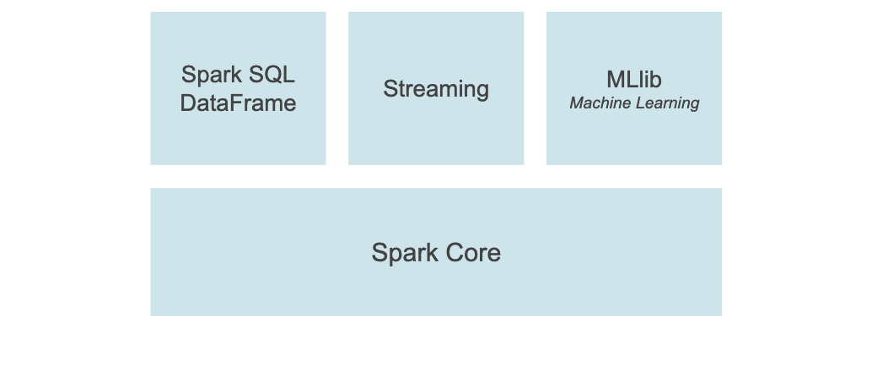

# About Apache Spark

## What is Apache Spark™?
- Apache Spark is a unified analytics engine for large-scale data processing. 
- It provides high-level APIs in Java, Scala, Python and R, and an optimized engine that supports general execution graphs. 
- It also supports a rich set of higher-level tools including Spark SQL for SQL and structured data processing, MLlib for machine learning, GraphX for graph processing, and Structured Streaming for incremental computation and stream processing.
- Apache Spark™ is a multi-language engine for executing data engineering, data science, and machine learning on single-node machines or clusters.

## Key Features

1. **SQL analytics**  
Execute fast, distributed ANSI SQL queries for dashboarding and ad-hoc reporting. Runs faster than most data warehouses.
2. **Batch/streaming data**  
Unify the processing of your data in batches and real-time streaming, using your preferred language: Python, SQL, Scala, Java or R.
3. **Data science at scale**  
Perform Exploratory Data Analysis (EDA) on petabyte-scale data without having to resort to downsampling
4. **Machine learning**  
Train machine learning algorithms on a laptop and use the same code to scale to fault-tolerant clusters of thousands of machines.

## About PySpark

- PySpark is an interface for Apache Spark in Python. 
- It not only allows you to write Spark applications using Python APIs, but also provides the PySpark shell for interactively analyzing your data in a distributed environment. 
- PySpark supports most of Spark’s features such as Spark SQL, DataFrame, Streaming, MLlib (Machine Learning) and Spark Core.

## PySpark Components    

1. **Spark SQL and DataFrame**  
    Spark SQL is a Spark module for structured data processing. It provides a programming abstraction called DataFrame and can also act as distributed SQL query engine.
2. **pandas API on Spark**  
    pandas API on Spark allows you to scale your pandas workload out. With this package, you can:
   - Be immediately productive with Spark, with no learning curve, if you are already familiar with pandas.
   - Have a single codebase that works both with pandas (tests, smaller datasets) and with Spark (distributed datasets).
   - Switch to pandas API and PySpark API contexts easily without any overhead.
3. **Streaming**  
    Running on top of Spark, the streaming feature in Apache Spark enables powerful interactive and analytical applications across both streaming and historical data, while inheriting Spark’s ease of use and fault tolerance characteristics.
4. **MLlib**  
    Built on top of Spark, MLlib is a scalable machine learning library that provides a uniform set of high-level APIs that help users create and tune practical machine learning pipelines.
5. **Spark Core**  
    Spark Core is the underlying general execution engine for the Spark platform that all other functionality is built on top of. It provides an RDD (Resilient Distributed Dataset) and in-memory computing capabilities.

### Information Sources
1. [Apache Spark Home](https://spark.apache.org/)
2. [Apache Spark Documentation](https://spark.apache.org/docs/latest/)
3. [PySpark Documentation](https://spark.apache.org/docs/latest/api/python/index.html)